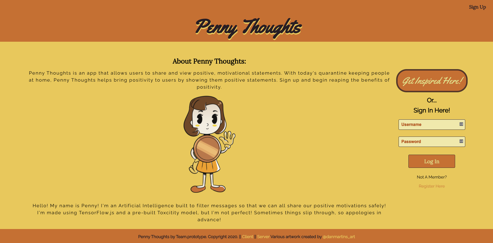
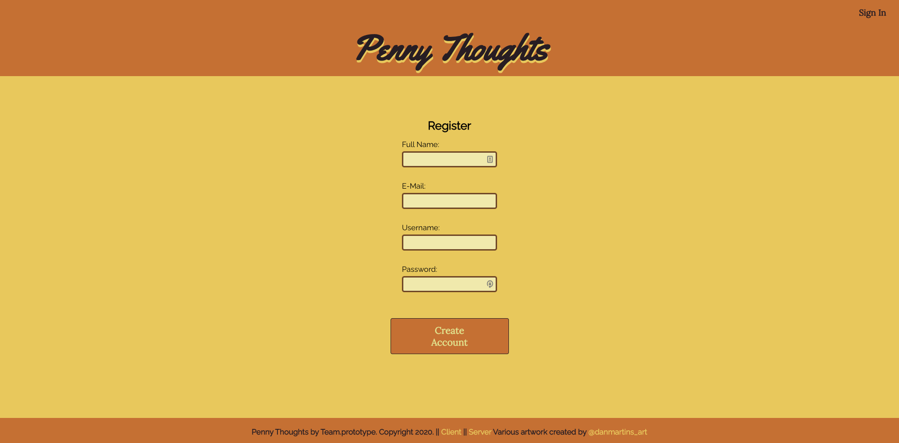
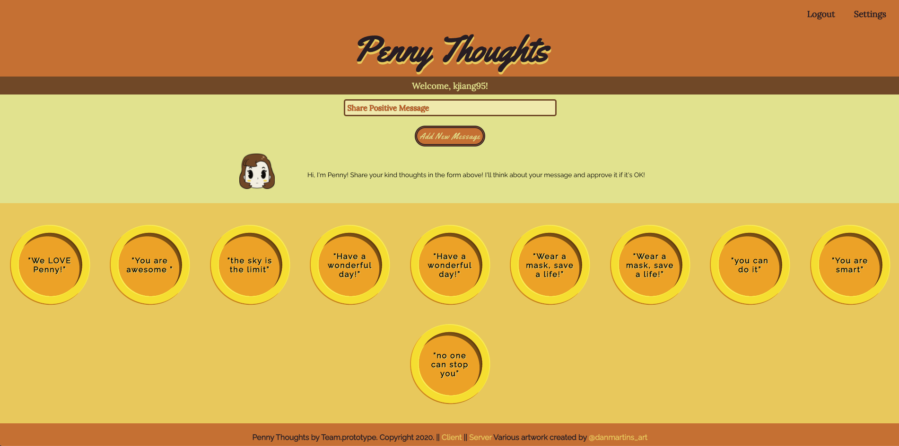
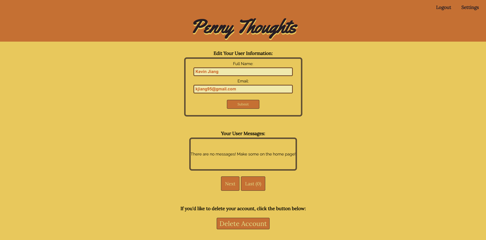
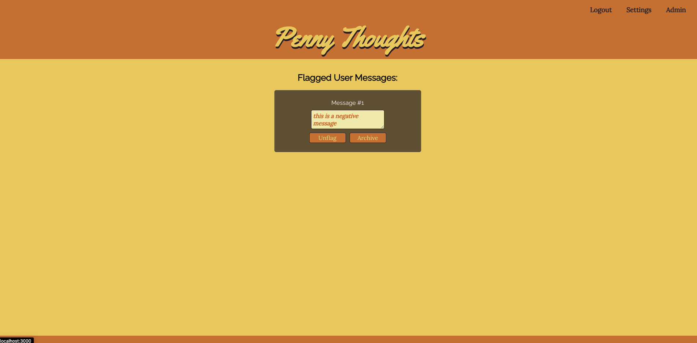

## Application
Penny Thoughts

## Built By
- Andrew Durrant
- Cesar Lenin Morales
- Daniel Sottile
- Joseph Rivera
- Kevin Jiang
- Logan Stribling

## Links
live site: https://penny-thoughts.vercel.app/ 
server: https://mighty-peak-21411.herokuapp.com/

## Using The API
Currently the API supports GET and POST endpoints.

- Unprotected Endpoints 
  + Sign Up: POST (https://url/api/api/users) 
  + Get 10 Random Messages: GET (https://url/api/api/messages) 

- Protected Endpoints 
  + Login: POST (https://url/api/auth/login) 
  + Edit Account Information: PATCH (https://url/api/users) 
  + Delete Account: DELETE (https://url/api/users) 
  + Submit a Message: POST (https://url/api/api/messages)
  + Get User's Submitted Messages: GET (https://url/api/messages/userData/:page) 
  + Edit User's Submitted Messages: PATCH (https://url/api/auth/messages/userData) 
  + Delete User's Submitted Messages: DELETE (https://url/api/auth/messages/userData) 
  + Report Messages: PATCH (https://url/api/auth/messages/report) 

- Admin Endpoints 
  + Get Reported Messages: GET (https://url/api/messages/flagged) 
  + Archive Reported Message: PATCH (https://url/api/messages/archive) 
  + Un-flag Reported Message: PATCH (https://url/api/messages/flagged) 

## Screen Shots
 
 
 
 
 

### Summary
This app is an uplifting, anonymous, message sharing app. Negative messages are filtered out using a toxicity filter from TensorFlow. 

## Technologies
- Font End
  * React
- Back End
  * Node.js
  * Postgresql
  * TensorFlow
- Testing
  * Mocha, Chai
  * Jest
